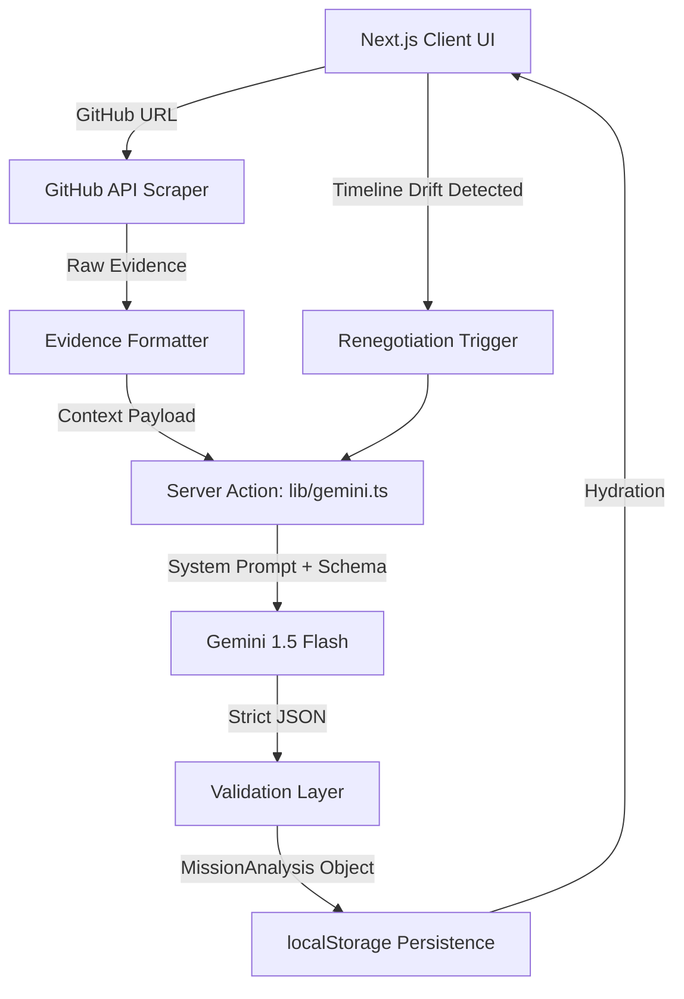

# MissionOS

**Repository Name:** last-minute-life-saver  
**Product Name:** MissionOS

> **MissionOS is our solution to the "Last-Minute Life Saver" problem statement.**
> **When the hackathon is ending and the project is burning, we don't need a project manager. We need an autonomous triage agent.**

## Elevator Pitch
An autonomous AI agent that ingests raw GitHub evidence to diagnose burning projects, simulate failure probabilities, and execute brutal, mathematically backed scope cuts to guarantee mission survival.

## Problem Statement
Development teams, especially in time-constrained environments like hackathons, suffer from sunk-cost fallacy and chronic over-optimism. When timelines drift, teams fail to execute necessary scope cuts, resulting in incomplete submissions. Existing tools like Jira only track tasks; they do not intervene, negotiate, or enforce reality.

## Why This is Different
MissionOS is an active intervention system, not a passive dashboard. It doesn't ask you what you want to do; it reads your repository, mathematically proves why your current trajectory will fail, and autonomously proposes brutal scope cuts. When timelines drift again, the system detects the failure and renegotiates the contract in real-time.

## Core AI Workflow
1. **Evidence Ingestion:** User inputs a GitHub URL (e.g., `facebook/react`).
2. **Context Assembly:** The Agent aggressively scrapes repository metadata and open issues via the GitHub API.
3. **Mission Diagnosis (Gemini 1.5 Flash):** The agent generates a comprehensive failure probability and resource conflict map.
4. **Strategy Formulation:** Gemini outputs multiple triage strategies, enforcing one "AI Recommended" critical path.
5. **Timeline Execution:** The team executes. If a milestone is missed, MissionOS detects the schedule drift.
6. **Autonomous Renegotiation:** The system immediately forces a re-evaluation of the mission, sacrificing further scope to salvage the core objective.

## Tech Stack
* **Frontend:** Next.js 16.2 (App Router), React, Tailwind CSS, TypeScript
* **State Management:** React Hooks synchronized seamlessly with `localStorage`
* **AI Provider:** Google Gemini API (`gemini-1.5-flash`)
* **Data Sources:** GitHub Public REST API
* **Architecture:** Edge-ready Server Actions with strictly enforced structured JSON schemas

## Google AI Technologies
* **Gemini 1.5 Flash:** Chosen for its extremely low latency and deep context window capabilities, perfect for rapid, high-stakes JSON generation.
* **Structured Output (`responseSchema`):** Enforces a rigid, unbending data contract that guarantees the frontend never breaks on malformed hallucinations.

## Architecture Diagram



## Installation

> *Note: The Git repository retains its original name for hackathon continuity.*

```bash
# Clone repository
git clone https://github.com/your-repo/last-minute-life-saver.git
cd last-minute-life-saver

# Install dependencies
npm install
```

## Environment Variables
Create a `.env.local` file in the root directory:
```env
GEMINI_API_KEY="your_google_ai_studio_api_key"
```

## Running Locally

```bash
npm run dev
# Server will start on http://localhost:3000
```

## Demo Mode
To ensure absolute reliability during live presentations, MissionOS features a robust, zero-network Demo Mode.
1. Start the application.
2. Open the developer panel in the bottom-right corner.
3. Toggle "Demo Mode" ON.
4. The application will now intercept all external network calls and simulate realistic latency and factual data flows using deterministic mock payloads.

## Limitations
* Currently relies on public GitHub repositories to bypass complex OAuth flows for hackathon simplicity.
* Stores mission state in `localStorage`, meaning cross-device synchronization is not yet supported.
* Drift detection currently triggers based on manual user confirmation of milestone completion rather than webhooks.

## Future Work
* **GitHub Webhooks:** Automate milestone completion via PR merges and commit signals.
* **Jira/Linear Integration:** Expand intake sources beyond GitHub.
* **Persistent Memory:** Migrate from `localStorage` to an edge database (e.g., Supabase) for multi-player team triage.
