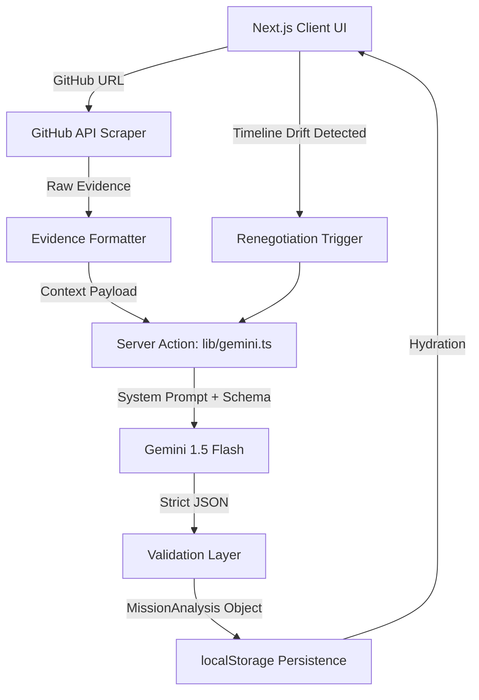

# Project Summary: MissionOS

## Features Implemented
* **Zero-Config Ingestion:** Direct GitHub public URL ingestion scraping open issues and metadata.
* **Algorithmic Triage:** Simulates mathematical failure probability based on required vs available hours.
* **Strategy Generation:** Autonomously outputs multiple survival paths with exact scope cuts and rationale.
* **Timeline Visualization:** Renders a sequential milestone path with critical node highlights.
* **Autonomous Drift Detection:** Detects when milestones are completed late and immediately forces a mission renegotiation.
* **Fail-Safe Offline Mode:** Integrated Demo Mode guarantees a flawless live presentation without network dependency.

## Agent Capabilities
* **Active Negotiation:** Unlike passive tools, the agent forces the user to accept scope cuts.
* **Context Awareness:** The agent reads the repository evidence to understand the context, ensuring cuts make logical sense.
* **Continuous Monitoring:** The agent observes execution over time and intervenes when schedules drift.

## Google Technologies
* **Gemini 1.5 Flash:** Chosen for high-speed, structured JSON generation over large contexts.
* **Structured Output:** Strictly enforced `SchemaType.OBJECT` guarantees the frontend and the LLM remain perfectly synchronized.

## Innovation Highlights
* **Anti-Slop UI:** Achieved a highly technical, brutalist "Terminal" aesthetic without relying on generic AI gradient blobs or over-engineered animations.
* **Serverless Orchestration:** Avoided complex multi-agent orchestrators (e.g., LangChain) in favor of lightning-fast Next.js Server Actions.

## Technical Implementation Highlights
* **Zero-Database Persistence:** Implemented a highly robust React Hook `localStorage` syncing mechanism, allowing the user to refresh or close the browser without losing any mission state.
* **Graceful Degradation:** The UI intercepts GitHub rate limits (403/429), malformed URLs, and Gemini hallucinations, falling back to human-readable error banners rather than catastrophic crashes.

## Architecture Summary
The application is a stateless Next.js App Router monolith. The client handles external API scraping (GitHub) to bypass server-side rate limits, compiles the evidence, and sends a single payload to a secure Server Action. The Server Action interfaces with Gemini, enforces the JSON schema, and returns the strictly typed `MissionAnalysis` object back to the client for rendering and `localStorage` caching.

## Known Limitations
* **Public Repos Only:** GitHub ingestion does not currently support OAuth, meaning private repositories cannot be scraped.
* **Single Player:** `localStorage` persistence prevents multi-user synchronization. Teams must share a single screen during triage.
* **Manual Signals:** Milestone completion requires the user to manually click and input the day, rather than automatically listening to GitHub PR merges.

---

# About MissionOS

**MissionOS is our solution to the "Last-Minute Life Saver" problem statement.**
When the hackathon is ending and the project is burning, we don't need a project manager. We need an autonomous triage agent.

## Elevator Pitch
An autonomous AI agent that ingests raw GitHub evidence to diagnose burning projects, simulate failure probabilities, and execute brutal, mathematically backed scope cuts to guarantee mission survival.

## Problem Statement
Development teams, especially in time-constrained environments like hackathons, suffer from sunk-cost fallacy and chronic over-optimism. When timelines drift, teams fail to execute necessary scope cuts, resulting in incomplete submissions. Existing tools like Jira only track tasks; they do not intervene, negotiate, or enforce reality.

## Why This is Different
MissionOS is an active intervention system, not a passive dashboard. It doesn't ask you what you want to do; it reads your repository, mathematically proves why your current trajectory will fail, and autonomously proposes brutal scope cuts. When timelines drift again, the system detects the failure and renegotiates the contract in real-time.

## Architecture Diagram



## Running Locally

```bash
# Clone repository
git clone https://github.com/rohitkhamrai/MissionOS.git
cd MissionOS

# Install dependencies
npm install

# Create environment file with Gemini Key
# GEMINI_API_KEY="your_api_key"
npm run dev
```
